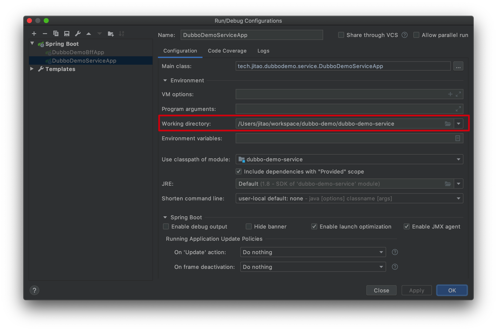

# Dubbo demo

一个演示 Spring Boot 和 Dubbo 配合的例子。打算顺手实现一个 RBAC 模型。

## 配置数据库

保证本机已安装好 MySQL。

```sql
create user jitao@localhost identified by 'jitao.tech';
flush privileges;
create database dubbo_demo DEFAULT CHARACTER SET utf8mb4 COLLATE utf8mb4_unicode_ci;
grant all privileges on dubbo_demo.* to jitao@localhost;
```

## IDEA 中运行代码的注意事项

因为这个示例是多个项目，所以，在运行的时候，为了使config目录中的配置文件生效，在IDEA中运行时，需要将工作目录设置为子项目目录。

例如，运行 DubboDemoServiceApp 时，需要配置运行目录为 dubbo-demo-service。

